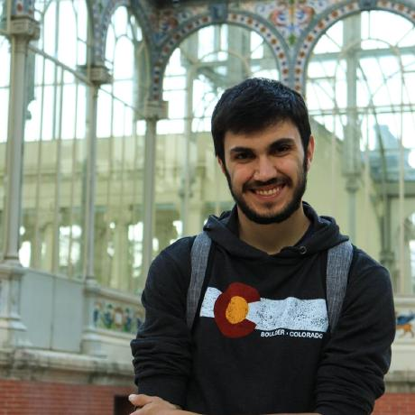
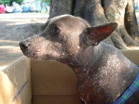

# Which dog are you?

[](http://hits.dwyl.io/AlbertSuarez/which-dog-are-you)
[](https://GitHub.com/AlbertSuarez/which-dog-are-you/stargazers/)
[](https://GitHub.com/AlbertSuarez/which-dog-are-you/network/)
[](https://github.com/AlbertSuarez/which-dog-are-you)

🐶 Dog and face person matcher based on image similarity

## Results

### Input

<p align="center">
  
</p>

### Output

<p align="center">
  
</p>

## Summary

> TODO: Paste Devpost summary.

## Project

### Requirements

1. Python 3.7+.

### Recommendations

Usage of [virtualenv](https://realpython.com/blog/python/python-virtual-environments-a-primer/) is recommended for package library / runtime isolation.

### Usage

To run the pipeline, please execute the following from the root directory:

1. Setup virtual environment

2. Install dependencies

    ```bash
    pip3 install -r requirements.lock
    ```

3. Download the [Standford Dogs dataset](https://www.kaggle.com/jessicali9530/stanford-dogs-dataset/data#) into `data/standford-dogs-dataset.zip`

4. Prepare dataset

    ```bash
    python3 -m src.prepare_dataset [--images_per_race N]
    ```

5. Build similarity index

    ```bash
    python3 -m src.build
    ```

6. Run similarity search

    ```bash
    python3 -m src.run [--image_url https://example.org/image.jpg] [--image_path image.jpg] [--show]
    ```

## Authors

- [Albert Suàrez](https://github.com/AlbertSuarez)

## License

MIT © Which dog are you?
